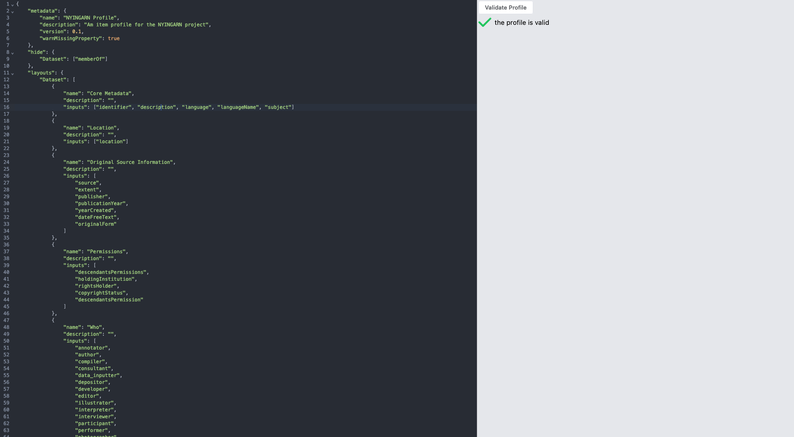

# Describo Profiles

Describo is driven by profiles. A profile is a set of instructions to the UI to describe how it
should act. This repository is the documentation for writing a profile. It also contains a small
application you can use to validate your profile. And there are example profiles in the repository
as well.

-   [Describo Profiles](#describo-profiles)
    -   [Profile versions - READ THIS](#profile-versions---read-this)
    -   [Profile documentation](#profile-documentation)
    -   [Profile Validation](#profile-validation)
        -   [Github Pages Profile Validation application](#github-pages-profile-validation-application)
        -   [Local Validation application](#local-validation-application)
    -   [Domain Specific profiles](#domain-specific-profiles)

## Profile versions - READ THIS

If you are writing a profile for Describo Online
[see the documentation with that repository](https://github.com/Arkisto-Platform/describo-online/wiki/Writing-a-domain-specific-profile).
This repository describes profiles for the
[Crate Builder Component](https://github.com/describo/crate-builder-component) which are an
evolution of those.

## Profile documentation

Describo profiles are a way to limit what your users can describe. By default, Describo makes
available all of Schema.org. Often times we don't want to expose all of this to our users so
profiles are a way for a community to tell Describo exactly what users are allowed to describe.

-   [Profile Structure](./profile-docs/profile-structure.md)
    -   [Classes and Inputs](./profile-docs/classes-and-inputs.md)
    -   [Resolve](./profile-docs/resolve.md)
    -   [Hide and Layouts](./profile-docs/hide-and-layouts.md)
    -   [Lookup](./profile-docs/lookups.md)
    -   [Types](./profile-docs/types.md)

## Profile Validation

### Github Pages Profile Validation application

You can validate your profile directly in Github at
[https://describo.github.io/profiles/](https://describo.github.io/profiles/). Otherwise, read on to
find out how to run the app on your local machine.

### Local Validation application

The repo contains a small VueJS/NodeJS app that you can run on your machine to validate the profile.
You will need docker to run it. To run it:

```
> cd profile-checker
> docker compose up
```

Then browse to `http://localhost:9000`. There is one view in the app containing a code editor on the
left hand side of the page and a validation results panel on the right. You are advised to develop
your profile in a code editor like VSCode (which will give you formatting and automatically quote
things for you) and then just copy that profile into the editor when you wish to check it.



## Domain Specific profiles

Example profiles from specific domains can be seen in the
[domain-profiles folder.](./domain-profiles/). If you'd like to publish your own profile for others
to work with or use please submit a pull request to this repository. You must:

-   create a folder preferably named by your domain in the `domain-profiles` folder.
-   name your profiles in there in some sensible way.

Optionally, add a README to your folder - absolutely recommended but not an essential requirement.
