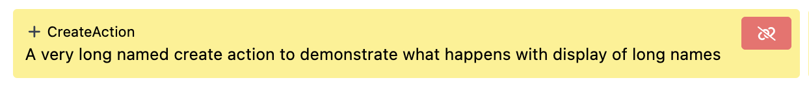
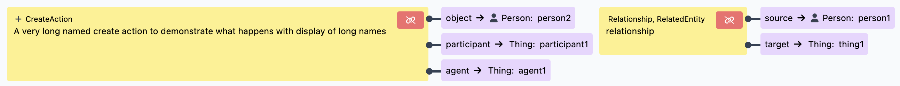

# Resolve

When you have a linking type entity like a CreateAction, by default you will see a link to the
CreateAction itself. But the action is really about the object, participant and agent so to display
that information you can define a resolve property in the profile.

The resolve property looks like:

```
...
    "resolve": [
        { "types": ["Relationship", "Related"], "properties": ["source", "target"] },
        {
            "types": ["CreateAction", "EditAction"],
            "properties": ["object", "participant", "agent"]
        }
    ],
...
```

In this example we have two configurations:

-   the first says that any entity with a type of `Relationship or Related` should have
    `source and target` properties resolved.
-   the second defines `CreateAction and EditAction` to have the `object, participant, and agent`
    properties resolved.

With the resolve property you see:


With the resolve definition above you see:


With a resolve property, the user can navigate to the linking entity or directly to something it is
about.
